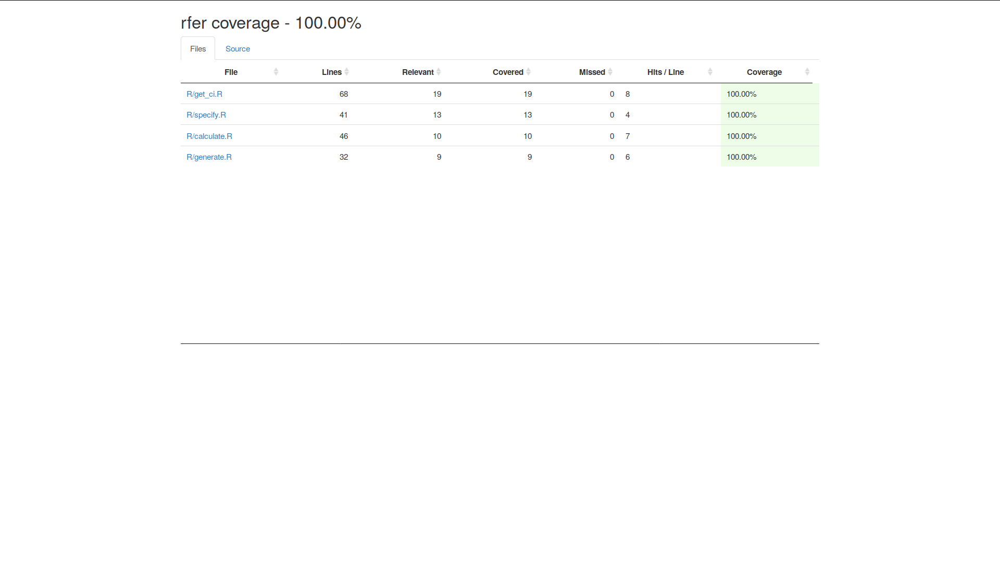

# Rfer

### Team

|Group Member |Github |
|-|-|
|Gabriel Bogo|[@GabrielBogo](https://github.com/GabrielBogo)|
|Yuwei Liu |[@liuyuwei169](https://github.com/liuyuwei169)|
| Weifeng (Davy) Guo |[@DavyGuo](https://github.com/DavyGuo)|
|Mohamad Makkaoui |[@makka3](https://github.com/makka3)|

Reimplementation of the `infer` R package, that offers a tidy way of developing statistical inference built on top of Tidyverse.

The infer package streamlines the process of reshuffling and bootstrapping of samples, calculating summary statistics and confidence intervals, and performing hypothesis tests for statistical inference. It does this using a combination of functions that are built with the emphasis on clear expressive code and using correct statistical grammar that explains the way the values are calculated and the tests are evaluated in statistical inference.

With this package as the inspiration, rfer will have four main functions (specify,generate,calculate,get_ci) for the first iteration. These functions will, given a data frame and the specified response variable; calculate summary statistics and confidence intervals for the response variable. Further details follow in the description of the functions below.

Where does `rfer` fit into the R ecosystem?

Currently, `infer` does a great job at implementing what we've specified for the functions in the R ecosystem. Nevertheless, we will begin by developing similar functions for the initial iterations with the expectation that we will add on extra functions that will enhance `infer` package at a later time.

## Installation instructions

To download and use this package:

`devtools::install_github("https://github.com/UBC-MDS/rfer.git")`

## Usable Example

```
library(rfer)
library(dplyr)


#Loading a sample dataset in Pandas
iris_df <-- iris

iris_width = specify(iris_df, response=Sepal.Width)
iris_resampled = generate(iris_width, n_samples=30, type="bootstrap")
width_mean = calculate(iris_resampled, stat="mean")
width_ci = get_ci(mpg_mean,level=0.9)
```

## Functions

### `specify`

**Function Description**: choose specific columns to feed the subsequent pipeline.

Inputs:  

- data: a Dataframe
- response: string. The column of your dataframe to be the response variable.

Output:  

- Dataframe containing one column for response variable and zero or more columns for the explanatory variables. The first column is always the response.

### `generate`

**Function Description**: Generate bootstrap resamples and permutations

Inputs:  

- data: a Dataframe generated from a `specify` function.
- n_samples: Integer. Number of resamples.
- type: "Bootstrap" (default), or "Permutation".

Output:  

- Dataframe containing all resamples stacked vertically. Will keep all columns from the input data and an additional sample_id column to identify individual resamples.

### `calculate`

**Function Description**: calculate a summarizing statistic for each bootstrap sample.

Inputs:  

- data: Dataframe generated by the `generate` function.
- stat: Summarizing statistic. "mean" (default) or "median"

Output:

- Dataframe of summarized data. Each row contains the summary statistic for a given resample.

### `get_ci`
**Function Description**: return the bootstrap confidence interval for a point estimate.


Inputs:

- data: Dataframe generated from `calculate` function.
- interval: Significance level. Percentage Float (0-100)

Output:

- Dataframe containing 1 row and columns for Statistic (Point Estimate), Significance Level, Lower Bound and Upper Bound.

### Coverage

